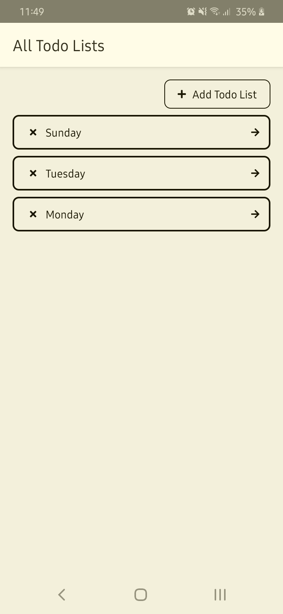
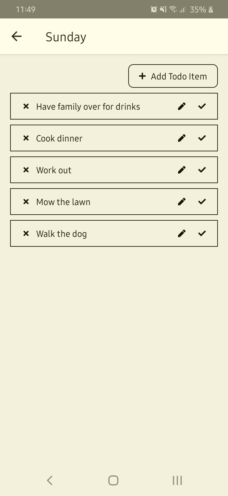

# Todo App

   

An application built in React Native to register todo lists and add items to them.
This application saves it's data locally by using the combination of React Context and the useReducer hook.

Note: The application is developed on an Android and might not work optimally on an iOS device.

## Why did I build this
I built this application to get some more experience with React Context and the useReducer hook before diving into Redux. I also tried out the styled-components library in this project to see how it would work in React Native.

### How to run
#### Locally
1. Clone the repository
2. Run `npm ci` in the root of the project
3. Run `npm run start` to start a packager
4. Run `npm run android` to run the application on a connected device or emulator
